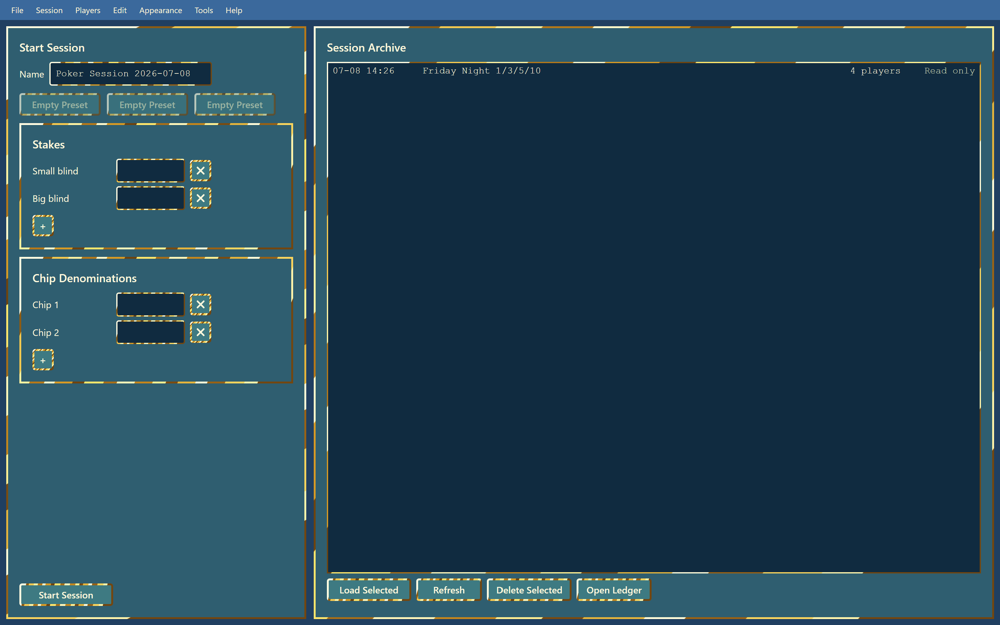
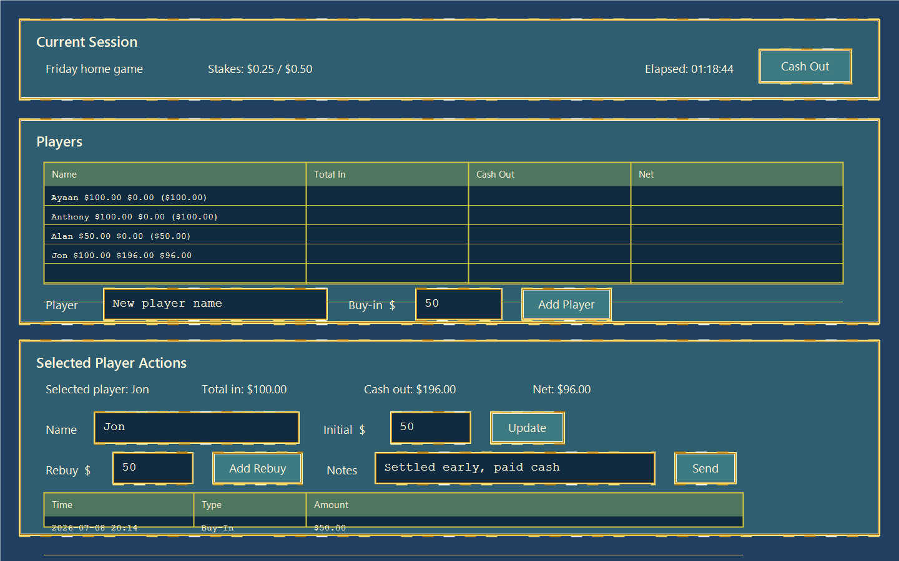
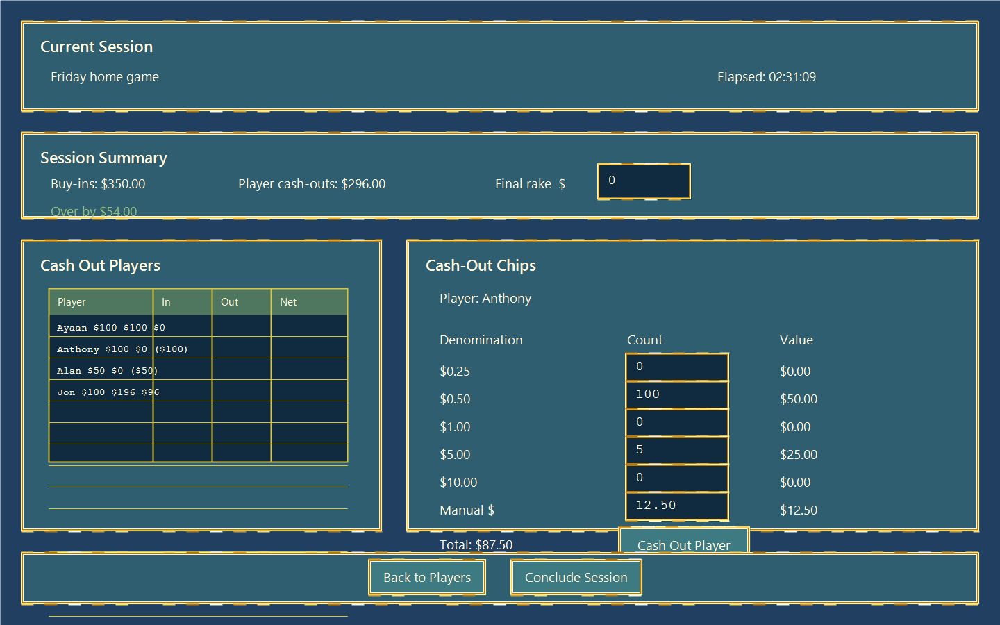
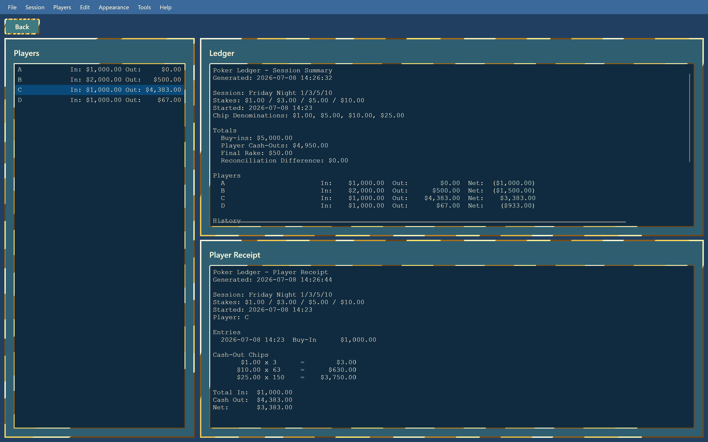

# Poker Ledger

Poker Ledger is a desktop app for tracking a private poker home-game session: setup presets, players, buy-ins, rebuys, cash-outs, balance checks, session archives, and read-only text receipts.

Development and support are focused on Windows only.

## Download

Download the latest Windows build from the [GitHub Releases page](https://github.com/Jschlawg/Poker-Ledger/releases/latest).

Use either release asset:

- The `.exe` asset ending in `-win-x64.exe` for the portable executable.
- The `.zip` asset ending in `-win-x64.zip` if you prefer downloading a compressed package.

Poker Ledger is currently distributed as a portable app, not an installer. Download the exe, place it wherever you want, and run it from there.

## Features

- Configure session name, blinds/ante, and chip denominations.
- Save and apply up to three setup presets.
- Track players, buy-ins, rebuys, notes, cash-outs, and net results.
- Enter chip counts by denomination with live cash-out and balance previews.
- Export finalized session summaries and per-player receipts as read-only text files.
- Import/export session JSON and app-data backups.
- Browse saved sessions and view an in-app ledger.
- Choose from contrast modes inspired by poker chip color palettes.

## Screenshots

### Start Session

### Player Session

### Cash Out

### Ledger View

## Contrast Modes

Poker Ledger includes multiple color palettes, all using the same gold-foil border style:

- Blue / Green / Gold
- Burgundy / Gold
- Red / Yellow
- White / Blue
- Black / Yellow

## Data Storage

Poker Ledger stores app data outside the repository:

- Windows: `%APPDATA%\PokerLedger`

Do not commit generated `data/`, `receipts/`, `logs/`, `dist/`, `bin/`, or `obj/` folders.

## Development

Developer setup, tests, and release packaging instructions live in [CONTRIBUTING.md](CONTRIBUTING.md).

## Legal Note

Poker Ledger is recordkeeping software. It does not determine whether a game, payout, rake, or local setup is legal. Users are responsible for complying with their local rules and laws.
